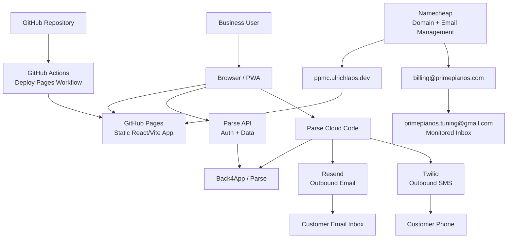

# Solution Architecture

## Overview

This solution is a lightweight customer management platform for a piano tuning business. It is designed to keep the frontend simple and inexpensive to host while delegating authentication, persistence, and outbound messaging to managed services.

At a high level, the solution consists of:

- A static React single-page application (SPA) built with Vite
- A Parse/Back4App backend for authentication, data storage, and access control
- Back4App Cloud Code for protected server-side messaging workflows
- GitHub Pages for production hosting of the frontend
- Namecheap for domain registration and business email management

## Infrastructure Diagram

### Diagram Notes

- Users access the static application through `ppmc.ulrichlabs.dev`
- `Namecheap` provides domain registration and email/forwarding management
- `GitHub Pages` hosts the static SPA built from the GitHub repository by `GitHub Actions`
- The browser talks directly to `Parse API` for authentication and CRUD operations
- The browser invokes `Parse Cloud Code` for protected messaging operations
- `Resend` is used only for outbound application email
- `Twilio` is used only for outbound application SMS
- `billing@primepianos.com` forwards inbound mail to `primepianos.tuning@gmail.com`

## Business Purpose

The application supports the day-to-day workflow of a piano service business by providing:

- Customer/contact management
- Appointment tracking
- Invoicing support
- Reminder and follow-up workflows
- Marketing blast support
- Business settings and tax defaults
- Communication logging

## Technology Choices

### Frontend

- `React 19`
- `TypeScript`
- `Vite 5`
- `react-router-dom`
- `vite-plugin-pwa`

The frontend is delivered as a static Progressive Web App (PWA). This keeps deployment simple and makes GitHub Pages a good fit for hosting.

### Backend and Data Platform

- `Parse Platform`
- `Back4App`

Back4App provides:

- User authentication
- Parse object storage
- ACL-based data isolation
- Parse Cloud Functions
- Runtime configuration through Parse Config

### Messaging Integrations

- `Resend` for outbound email
- `Twilio` for outbound SMS

These integrations are intentionally routed through Cloud Code so API credentials are never exposed in the browser.

Provider responsibilities:

- `Resend` handles transactional and marketing email delivery initiated by the application
- `Twilio` handles outbound SMS for reminders, follow-ups, and other text-message workflows

### Hosting and Delivery

- `GitHub Pages` for static frontend hosting
- `GitHub Actions` for CI/CD deployment automation

### Domain and Email

- `Namecheap` is used for domain registration
- Production custom domain: `ppmc.ulrichlabs.dev`
- Business email account managed through Namecheap: `billing@primepianos.com`

## Solution Structure

### Frontend application

The main application lives in:

- [src/App.tsx](/d:/repo/customer-management/src/App.tsx)
- [src/lib/parse.ts](/d:/repo/customer-management/src/lib/parse.ts)
- [src/types.ts](/d:/repo/customer-management/src/types.ts)

Responsibilities:

- User login/logout
- Customer CRUD
- Appointment CRUD
- Reminder/follow-up/invoice workflows
- Calling Parse Cloud Functions for email and SMS
- PWA registration and offline-capable shell behavior

### Cloud Code

The server-side messaging layer lives in:

- [cloud/main.js](/d:/repo/customer-management/cloud/main.js)
- [cloud/package.json](/d:/repo/customer-management/cloud/package.json)

Responsibilities:

- Validate authenticated user context
- Load provider credentials from environment variables or Parse Config
- Send email via Resend
- Send SMS via Twilio
- Persist `CommunicationLog` records after successful sends

### Deployment workflow

The GitHub Pages deployment workflow lives in:

- [.github/workflows/deploy-pages.yml](/d:/repo/customer-management/.github/workflows/deploy-pages.yml)

Responsibilities:

- Install dependencies
- Build the Vite app
- Inject Parse environment variables from GitHub Secrets
- Publish the `dist/` output to GitHub Pages

## Runtime Architecture

### Client-side runtime

The browser hosts the React SPA. The app loads the Parse JavaScript SDK from `public/parse.min.js`, initializes Parse using Vite environment variables, and then performs authenticated CRUD operations directly against the Parse API.

This is appropriate here because:

- The app is primarily internal/business-use software
- Parse ACLs are used to isolate each user's data
- Static hosting keeps operational cost and complexity low

### Server-side runtime

Cloud Code runs separately from the static frontend and acts as the protected execution boundary for:

- Email sending
- SMS sending
- Provider credential use
- Communication audit logging

This prevents secrets such as `RESEND_API_KEY` and Twilio credentials from being embedded in frontend bundles.

In production, the messaging flow is:

1. The React app calls a Parse Cloud Function.
2. Back4App Cloud Code validates the authenticated user and request payload.
3. Cloud Code sends email through `Resend` or SMS through `Twilio`.
4. Cloud Code writes a `CommunicationLog` record back to Parse for audit/history purposes.

## Data Model

The README and code indicate these main Parse classes:

- `Customer`
- `Appointment`
- `Business_Settings`
- `CommunicationLog`

### Customer

Stores customer profile and reminder preferences, including:

- Name
- Address
- Email
- Phone
- Contact preference
- Reminder/follow-up timing
- Marketing opt-in
- Notes

### Appointment

Stores service activity and billing-related information, including:

- Customer linkage
- Appointment date
- Quoted estimate
- Travel charge
- Additional charges
- Tax amount
- Payment method
- Status
- Invoice/follow-up timestamps

### Business_Settings

Stores operator-configurable defaults, including:

- Business name
- Website URL
- Venmo handle
- Voice phone
- Default tax rate
- Reminder cadence
- Follow-up cadence
- Marketing exclusion window
- Email/SMS signature text

### CommunicationLog

Stores the audit trail for outbound communications, including:

- Channel
- Provider
- Kind
- Recipient
- Subject/body
- Related customer/appointment identifiers
- Provider message identifier

## Security Model

### Authentication

Authentication is handled by Parse user accounts.

### Authorization

New records are created with private ACLs tied to the signed-in user. The app also stamps records with:

- `ownerId`
- `ownerUsername`

This gives the solution both ACL-based protection and owner metadata for filtering/reporting.

### Secrets management

Secrets are split by concern:

- Frontend runtime configuration is provided via GitHub repository secrets during build:
  - `VITE_PARSE_APP_ID`
  - `VITE_PARSE_JAVASCRIPT_KEY`
  - `VITE_PARSE_SERVER_URL`
- Server-side messaging secrets are expected in Back4App Cloud Code environment variables or Parse Config:
  - `RESEND_API_KEY`
  - `RESEND_FROM_EMAIL`
  - `RESEND_REPLY_TO`
  - `TWILIO_ACCOUNT_SID`
  - `TWILIO_AUTH_TOKEN`
  - `TWILIO_API_KEY_SID`
  - `TWILIO_API_KEY_SECRET`
  - `TWILIO_FROM_NUMBER`

## Deployment Architecture

### Source control and CI/CD

- Source code is stored in GitHub
- Deployments are triggered from the `main` branch
- GitHub Actions builds and deploys the frontend to GitHub Pages

### Frontend hosting

The production frontend is hosted on GitHub Pages.

The deployment workflow sets:

- `GITHUB_PAGES=true`
- `GITHUB_PAGES_CUSTOM_DOMAIN=true`

This is important because [vite.config.ts](/d:/repo/customer-management/vite.config.ts) switches the Vite `base` path to `/` when a custom domain is used. That behavior is required for the custom-domain GitHub Pages deployment at `ppmc.ulrichlabs.dev`.

### Custom domain

GitHub Pages is configured with the custom domain:

- `ppmc.ulrichlabs.dev`

Namecheap is used as the domain registrar for the relevant DNS-managed domain assets. In practice, that means:

- Domain ownership/registration is managed in Namecheap
- DNS records supporting the GitHub Pages custom domain are expected to be managed from the Namecheap side
- GitHub Pages serves the static app at the custom hostname once DNS and Pages settings align

### Backend hosting

The backend is not hosted in GitHub Pages. It is split across:

- Back4App Parse API for application data and authentication
- Back4App Cloud Code for trusted messaging operations
- Resend as the managed outbound email provider
- Twilio as the managed outbound SMS provider

## External Dependencies

The production solution depends on the availability of:

- GitHub Pages
- GitHub Actions
- Back4App / Parse
- Resend
- Twilio
- Namecheap DNS/domain services

## Email Architecture Notes

There are two distinct email concerns in this solution:

### Application-generated outbound email

The application currently sends outbound business email through `Resend` via Cloud Code.

Related Cloud Functions:

- `sendBusinessEmail`
- `sendMarketingBlast`

Primary configuration values:

- `RESEND_API_KEY`
- `RESEND_FROM_EMAIL`
- `RESEND_REPLY_TO`

### Application-generated outbound SMS

The application currently sends outbound business SMS through `Twilio` via Cloud Code.

Related Cloud Function:

- `sendBusinessSms`

Primary configuration values:

- `TWILIO_ACCOUNT_SID`
- `TWILIO_AUTH_TOKEN`
- `TWILIO_API_KEY_SID`
- `TWILIO_API_KEY_SECRET`
- `TWILIO_FROM_NUMBER`

### Business mailbox

The mailbox `billing@primepianos.com` exists as an operational/business email account managed through Namecheap. It is configured to forward all inbound messages to `primepianos.tuning@gmail.com`, which serves as the monitored mailbox.

Operationally, that means:

- `billing@primepianos.com` is the business-facing address
- Namecheap handles the mailbox/forwarding configuration
- `primepianos.tuning@gmail.com` is the actively monitored destination inbox

Based on the current codebase, this should still be documented as business infrastructure rather than the application's transactional email transport unless that is changed later.

If desired in a future iteration, this mailbox could become:

- A reply-to address for outbound application email
- A billing/contact mailbox referenced in templates
- A monitored support or accounts-receivable inbox alias that continues forwarding to the Gmail mailbox

## Build and Environment Model

### Local development

Local development uses:

- `npm install`
- `npm run dev`

The frontend expects local Parse configuration values in a local environment file.

### Production build

Production builds use:

- `npm run build`

The output is a static `dist/` folder suitable for GitHub Pages.

## Architectural Rationale

This architecture is a strong fit for the current solution because it:

- Minimizes hosting cost by keeping the UI static
- Avoids maintaining a custom application server
- Uses managed auth and persistence through Back4App
- Keeps provider secrets off the client
- Supports a small-business workflow without overengineering

## Known Boundaries and Assumptions

- The frontend is a SPA and depends on Parse/Back4App availability at runtime
- Messaging delivery depends on external providers rather than a local mail/SMS subsystem
- The GitHub Pages custom domain is configured operationally in GitHub Pages settings rather than in application code
- The `billing@primepianos.com` mailbox forwards to `primepianos.tuning@gmail.com`; the codebase currently shows `Resend` as the outbound email provider

## Recommended Future Enhancements

- Add backup/export guidance for Parse data
- Add an environment matrix for dev/test/prod
- Document DNS records for `ppmc.ulrichlabs.dev`
- Document whether `billing@primepianos.com` should be used as the Resend `reply-to` or sender identity
